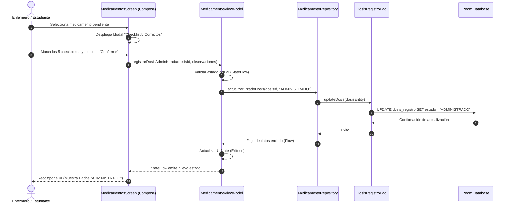
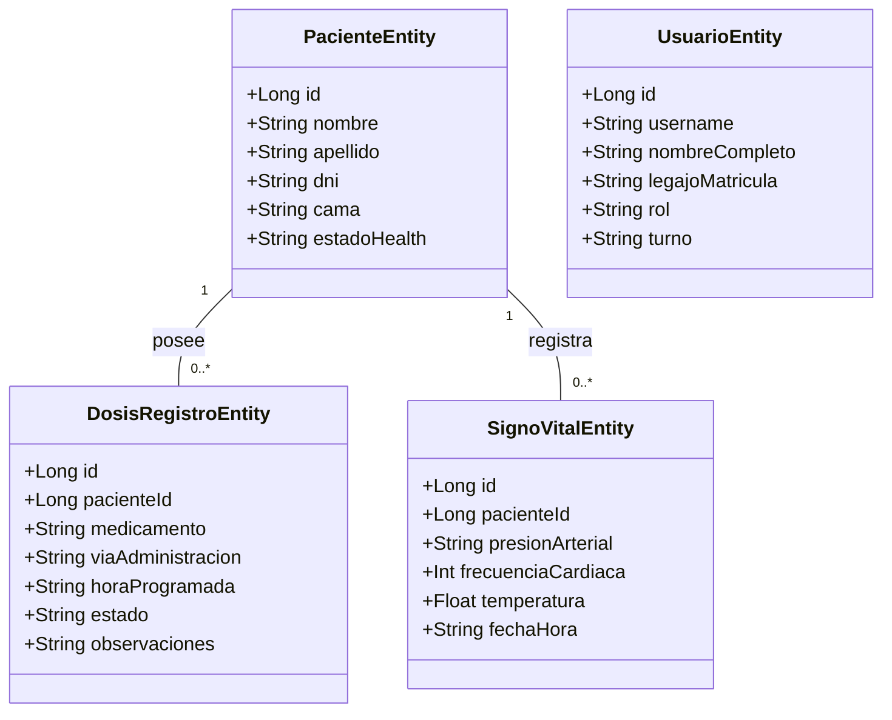

# ClinickCheck 💉

**ClinickCheck** es una aplicación móvil nativa para Android desarrollada para estudiantes y profesionales de enfermería. Su objetivo fundamental es digitalizar y optimizar el **control de administración de medicamentos (MAR)**, el **seguimiento de signos vitales** y la **trazabilidad del historial clínico simplificado** en un entorno seguro, ágil y con soporte operativo offline.

---

## 🚀 Características Principales

* 📊 **Dashboard y Resumen de Turno:** Panel principal con contadores de pacientes, alertas de estado crítico y accesos rápidos a tareas clínicas.
* 💊 **Administración de Medicamentos (MAR):** Control de dosis programadas, selección de vías de administración y modal obligatorio de verificación de los **"5 Correctos"** (Paciente, Medicamento, Dosis, Vía, Hora).
* 🩺 **Registro de Signos Vitales:** Captura e historial cronológico de presión arterial (mmHg), frecuencia cardíaca (bpm), frecuencia respiratoria (rpm) y temperatura (°C).
* 📋 **Gestión de Pacientes e Historias Clínicas:** Registro, búsqueda avanzada (DNI/Nombre) y clasificación por estados (*Estable, Crítico, Alta*).
* 👤 **Perfiles y Gestión Multiusuario:** Creación y alternancia rápida de perfiles de usuario locales para turnos compartidos o prácticas docentes.
* 📶 **Operatividad Offline:** Persistencia local completa mediante base de datos SQLite con Room.

---

## 🛠️ Tecnologías Utilizadas

| Componente | Tecnología / Librería |
| :--- | :--- |
| **Lenguaje** | Kotlin |
| **UI Framework** | Jetpack Compose (Material Design 3) |
| **Arquitectura** | MVVM (Model-View-ViewModel) + Clean Architecture |
| **Inyección de Dependencias** | Hilt / Android Jetpack |
| **Base de Datos Local** | Room Database |
| **Asincronía y Estado** | Corrutinas Kotlin & StateFlow / Flow |

---

## 📋 Historias de Usuario Relevantes

| Código | Usuario / Rol | Requerimiento / Funcionalidad | Estado |
| :---: | :--- | :--- | :---: |
| **HU-01** | Paula Mendoza *(Auxiliar)* | Registrar notas de enfermería con cada procedimiento para trazabilidad del cuidado. | ✅ |
| **HU-02** | Sara Galvis *(Estudiante)* | Consultar historial clínico antes de registrar signos vitales para conocer condiciones previas. | ✅ |
| **HU-03** | Laura Chaparro *(Estudiante)* | Visualizar el propósito de cada dato solicitado en formularios clínicos. | ✅ |
| **HU-04** | Karen Nava *(Enfermera)* | Registrar recomendaciones del personal de salud dirigidas al paciente. | ✅ |
| **HU-05** | Karol Leon *(Estudiante)* | Documentar observaciones en un campo de notas asociado a cada administración de dosis. | ✅ |
| **HU-06** | Michelle Díaz *(Auxiliar)* | Vincular historial clínico general con alertas de signos vitales. | ✅ |
| **HU-07** | Brayan Mendez *(Estudiante)* | Diferenciación de vista enfermero/paciente. *(Reemplazado por modo uso exclusivo clínico)*. | ❌ *(N/A)* |
| **HU-08** | Karol *(Auxiliar)* | Acceso directo a clasificación ICD-10 para estandarización diagnóstica. | ✅ |
| **HU-09** | Juan Felipe Giraldo *(Auxiliar)* | Navegación entre pestañas fluida y visualmente consistente. | ✅ |
| **HU-10** | Estudiante Anónimo | Checklist de verificación de "5 Correctos" simple y sin distracciones. | ✅ |

---

## 🔄 Flujo Operativo (Diagrama de Secuencia)

Administración de medicamento con validación del checklist de los "5 Correctos":



---

## 📐 Modelado UML del Dominio



---

## ⚙️ Configuración del Entorno Local

### 1. Clonar el repositorio
```bash
git clone [https://github.com/ronal-sudo-lv/ClinickCheck.git](https://github.com/ronal-sudo-lv/ClinickCheck.git)
cd ClinickCheck
```

## 👤 Autor

* **Ronal Linares** - [*ronal-sudo-lv*](https://github.com/ronal-sudo-lv)
